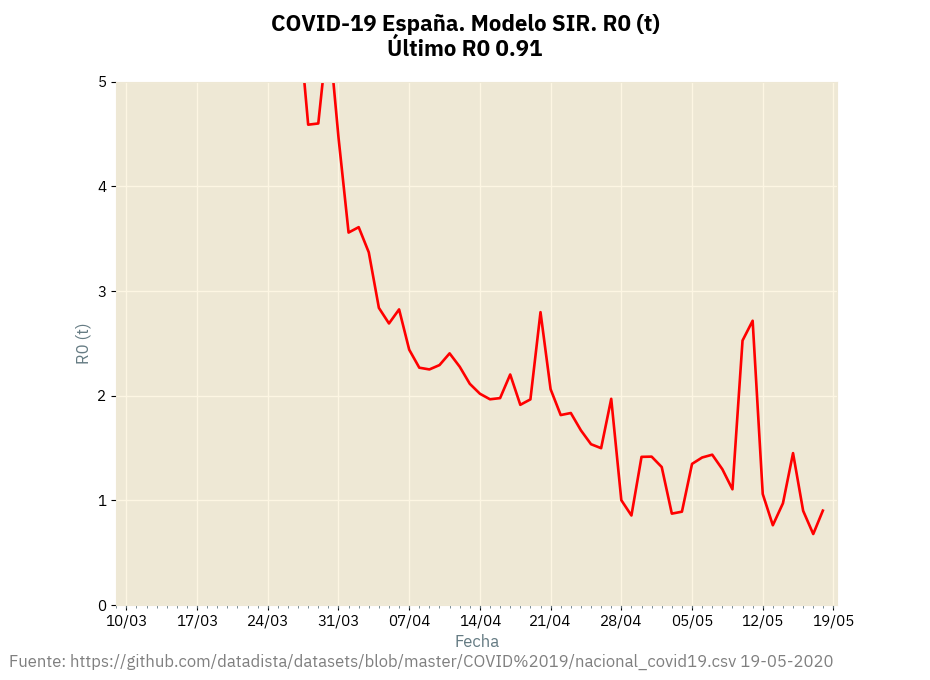

= Covid 19 en España (13 de abril)
:author: Antonio Vieiro <antonio@vieiro.net>
:date: 2020-04-13
:toc: left
:toc-title: Índice

Un ejercicio de Python para ver cómo vamos con el COVID-19 en España.

El objetivo principal es practicar un poco el Python 3, evitar ver mucho la
tele y, ya de paso, calcular una aproximación al famoso parámetro `R0` y ver si
la cosa va a mejor o no.

NOTE: La precisión de los cálculos es la que es, yo no respondo de las conclusiones que saque cada cual.

== Los datos

Los datos son los de Datadista, disponibles en https://raw.githubusercontent.com/datadista/datasets/master/COVID%2019/nacional_covid19.csv, que se actualizan diariamente.

== El programa

El programa es link:sir2.py[sir2.py]. Es un programa sencillo que puede hacerse con Excel.

== El modelo SIR

El link:https://en.wikipedia.org/wiki/Compartmental_models_in_epidemiology#Bio-mathematical_deterministic_treatment_of_the_SIR_model[modelo SIR]
está en todos los periódicos. 

La página link:https://mathworld.wolfram.com/Kermack-McKendrickModel.html[Modelo Kermack-McKendrick] de MathWorld explica bastante bien el problema.

El valor `R0(t)` puede calcularse según link:ecuaciones.pdf[estas aproximaciones (PDF)].

Se obtiene:

[source]
----

R0(t) = (DR + DI) / DR

----

Donde `DR` es el incremento (diario, semanal, etc.) de personas recuperadas (o
fallecidas) y `DI` es el incremento (en la misma unidad de tiempo) de personas
infectadas.

Es decir, a principios de marzo una persona infectaría alrededor de 6-8 personas durante su enfermedad, y a día de hoy,
22 de abril, una persona infectará sólo a unas 2.68 personas, es decir, casi tres personas.

¡Ánimo y salud a todos!

