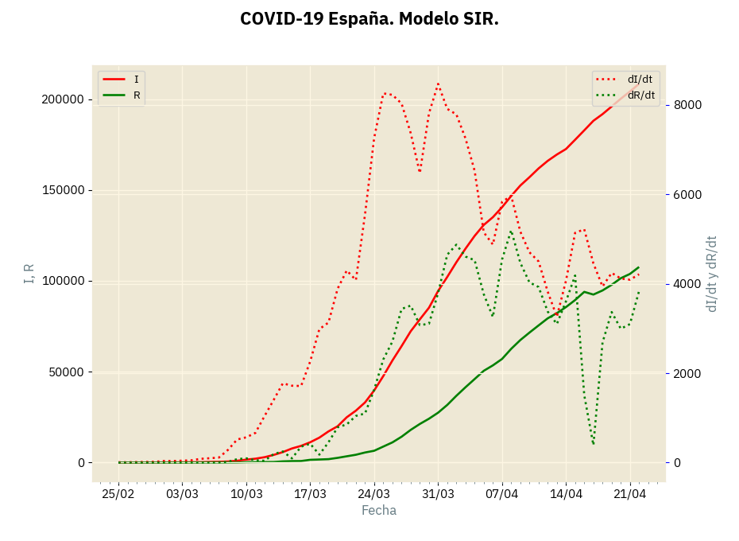
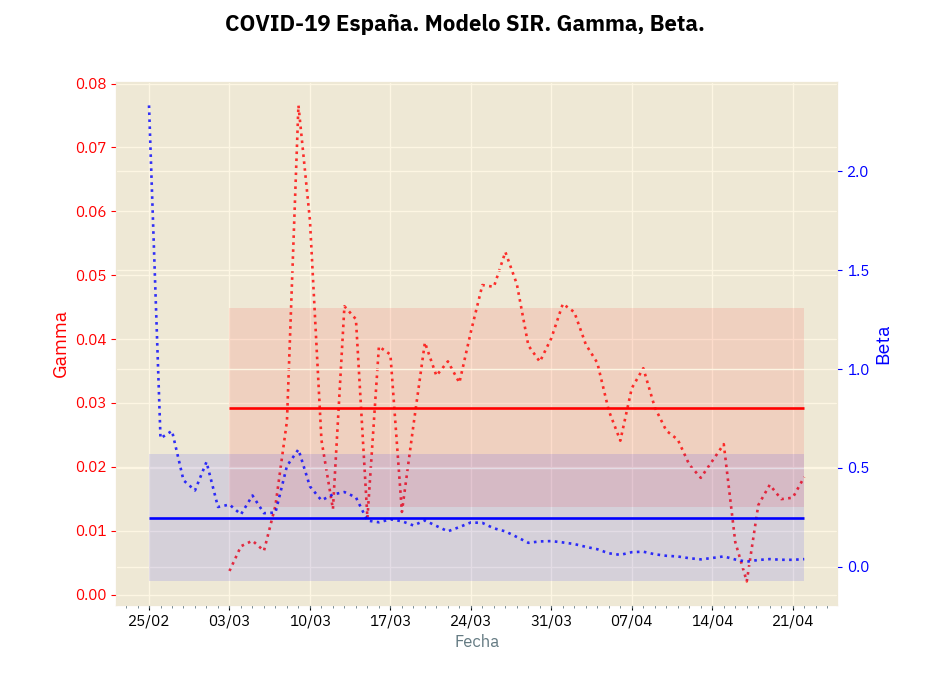

= Covid 19 en España (13 de abril)
:author: Antonio Vieiro <antonio@vieiro.net>
:date: 2020-04-13
:toc: left
:toc-title: Índice

Un ejercicio de Python para ver cómo vamos con el COVID-19 en España.

El objetivo principal es practicar un poco el Python 3, evitar ver mucho la
tele y, ya de paso, calcular una aproximación al famoso parámetro `R0` y ver si
la cosa va a mejor o no.

NOTE: La precisión de los cálculos es la que es, yo no respondo de las conclusiones que saque cada cual.

== Los datos

Los datos son los de Datadista, disponibles en https://raw.githubusercontent.com/datadista/datasets/master/COVID%2019/nacional_covid19.csv, que se actualizan diariamente.

== El programa

El programa es link:sir.py[sir.py]. Está feíllo por dentro, pero me funciona.
Si hay errores o mejoras no muy complejas agradezco correcciones.

== El modelo SIR

El link:https://en.wikipedia.org/wiki/Compartmental_models_in_epidemiology#Bio-mathematical_deterministic_treatment_of_the_SIR_model[modelo SIR]
está en todos los periódicos. 

Todo el mundo nos dice que hay un parámetro llamado `R0` que tenemos que bajar,
pero nadie es capaz de decirnos ni cuánto vale ahora ni si estamos bajándolo o no. 

Parece que hay que resolver una ecuación diferencial, que es difícil con los datos que hay.

=== La aproximación

La aproximación que realizo en el programa es aproximar las derivadas con
respecto al tiempo por incrementos diarios (después de todo los datos nos los
envían diariamente). O sea, que "la derivada de x respecto al tiempo" lo cambiamos
por "el incremento de x respecto al tiempo".

=== Funciones S, I, R

- `S(t)` representa el número de personas susceptibles de infectarse en cada momento.
- `I(t)` representa el número de personas ya infectadas.
- `R(t)` representa el número de personas que se han recuperado o han muerto.

Estas funciones se pueden calcular fácilmente a partir del archivo de datos:

- `I(t)` es el número de casos.
- `R(t)` es la suma del número de recuperados y los fallecimientos.
- `S(t)` es el número total de personas en España (45 millones, el número exacto es indiferente para estos cálculos).

=== Derivadas dS/dt, dI/dt y dR/dt

Estas derivadas las calculamos como incrementos, o sea: `df(x)/dt ~= f(x+1)-f(x).` Es una aproximación bastante bruta, pero es rápida de hacer. Hay aproximaciones
más precisas para las derivadas, igual otro día las hago.

=== Curvas de infectados y recuperados

La primera gráfica que pintamos es la de `I(t)` (infectados) y `R(t)` (recuperados o fallecidos), y las derivadas
correspondientes. Tiene esta pinta:

Si la comparamos con esta de la Wikipedia:

y nos fijamos en `I(t)` y `R(t)` veremos que estamos (a día 13 de abril)
todavía en la primera parte de crecimiento de las infecciones, que no hemos
empezado a bajar en el número de infecciones.

=== Cálculo de beta y gamma

Usamos esta ecuación de la wikipedia:

Para despejar gamma y beta, que resultan en estos valores:

Las líneas contínuas son los valores medios, las bandas la desviación estándar (que es grande, por supuesto, porque hay gran variación temporal y
porque estamos usando aproximaciones y no derivadas).

=== Cálculo de R0

Finalmente calculamos el afamado parámetro `R0` del que hablan todos los periódicos (
link:https://www.bbc.com/mundo/noticias-51469198[bbc.com],
link:https://es.gizmodo.com/que-es-el-numero-r0-de-un-virus-y-por-que-es-tan-import-1841299256[gizmodo],
link:https://www.vozpopuli.com/altavoz/next/Coronavirus-Wuhan-significa-numero-Ro_0_1323168955.html[VozPópuli],
link:https://www.eldiario.es/sociedad/multiplicacion-Espana-acerca-expansion-epidemia_0_1012799050.html[El Diario], etc.),
que es el resultado de dividir beta entre gamma, y que es así:

image::covid-spain-sir-r0.png[title="Evolución aproximada de R0 en España"]

Es decir, a principios de marzo una persona infectaría alrededor de 6-8 personas durante su enfermedad, y a día de hoy,
13 de abril, una persona infectará sólo a unas 2.2 personas.

¡Ánimo y salud a todos!

